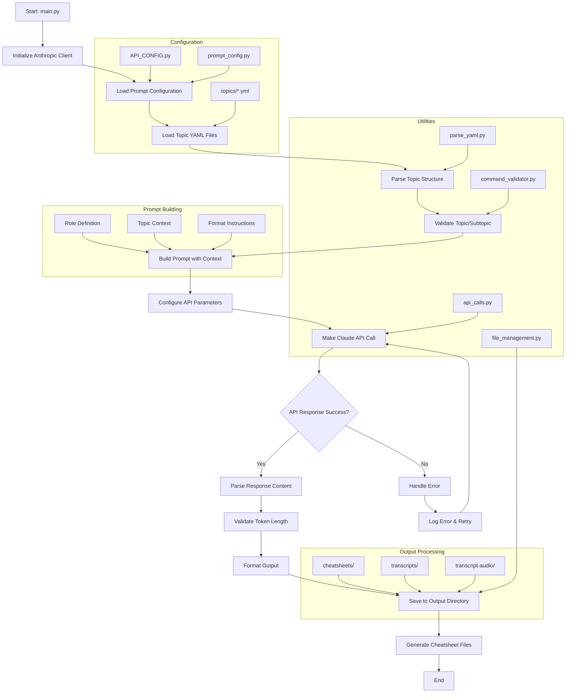

# cheatsheet-generator
A dynamic cheatsheet generator which generates self-validating cheatsheets for tools specified in a topic-subtopic structure.

> [!TIP] To run via CLI:
> ```bash
> python cli.py --topic <TOPIC>
> ```

## Features:
- safe generated files
- configurable calls to different LLM clients

## Design:
